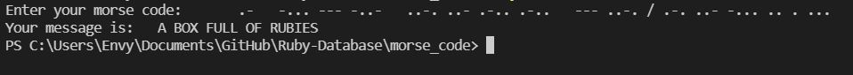

# Decode a Morse code message

During your vacation at the seaside, time after time you find old bottles with parchment inside. Out of curiosity, you look into the next bottle and see that there is a message written in Morse code. Your curiosity grows even more - maybe you just found the lost treasure of the pirates! However, you are getting tired of decrypting messages manually. Fortunately, you can program in Ruby and you can help yourself by automating this process.

## Built With
- Ruby
- rubocop

## Author
👤 **Olipliche Mavoungou Paka**
- GitHub: [https://github.com/OLIPLICHE)
- LinkedIn: [LinkedIn](https://www.linkedin.com/in/olipliche/)

## 🤝 Contributing
Contributions, issues, and feature requests are welcome!

## Show your support
Give a ⭐️ if you like this project
## Acknowledgments
- Hat tip to anyone whose code was used
- Inspiration

## 📝 License
This project is [Microverse](https://www.microverse.org/) licensed.
